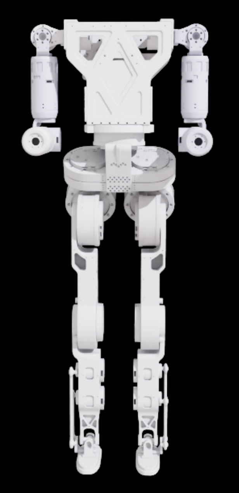

# atom01-rl-locomotion

Reinforcement learning training for the **atom01** humanoid robot using Isaac Lab.

## Robot

## Results

### Static Balance 1 — Reward function only (no randomization)

### Static Balance 2 — With domain randomization

### Static Balance 3 — With domain randomization2
